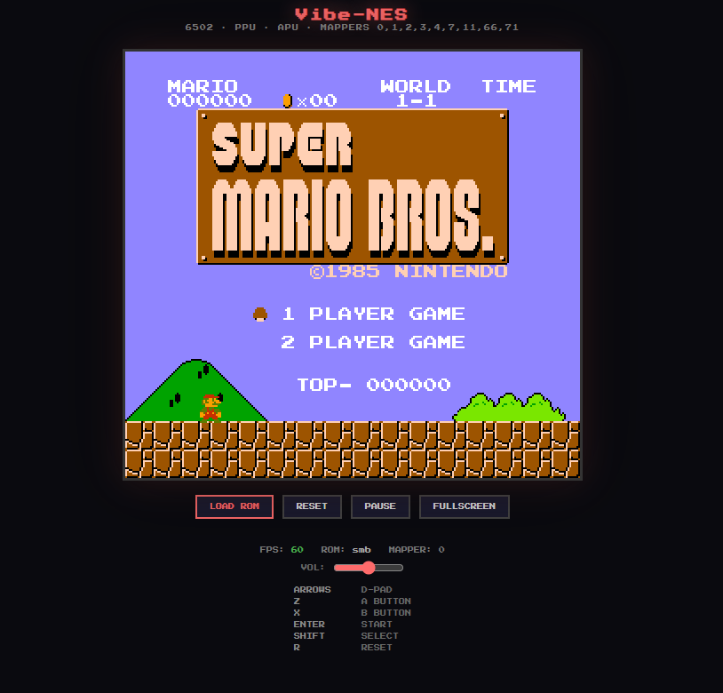

# Vibe-NES
<p align="center">
  
</p>

# Vibe-NES

```text
 __      ___ _                 _   _ ______  _____ 
 \ \    / (_) |               | \ | |  ____|/ ____|
  \ \  / / _| |__   ___ ______|  \| | |__  | (___  
   \ \/ / | | '_ \ / _ \______| . ` |  __|  \___ \ 
    \  /  | | |_) |  __/      | |\  | |____ ____) |
     \/   |_|_.__/ \___|      |_| \_|______|_____/ 
                                                   
                                                   
```

**Vibe-NES** is a high-performance **single-file NES emulator** vibe-coded by claude sonnet 4.6 and google gemini 3 pro.

Designed for **simplicity and portability**, it packs a full **8-bit hardware stack into a single HTML file**.

No installation.
No dependencies.
Just **vibes**.

---

# 📸 Preview

Drag and drop your favorite `.nes` ROMs to start playing.

---

# 🚀 Quick Start

1. Download **`vibe-nes.html`**
2. Open it in any modern web browser

   * Chrome
   * Firefox
   * Edge
   * Safari
3. Load a ROM by:

   * Dragging a `.nes` file into the window
     **or**
   * Clicking the **LOAD ROM** button
4. Start playing.

---

# 🕹️ Controls

| Key        | NES Button |
| ---------- | ---------- |
| Arrow Keys | D-Pad      |
| Z          | A Button   |
| X          | B Button   |
| Enter      | Start      |
| Shift      | Select     |
| R          | Hard Reset |
| P          | Pause      |

---

# 🧠 Technical Deep Dive

Vibe-NES reconstructs the architecture of the original NES hardware.

---

## CPU — MOS 6502 (Custom Ricoh 2A03)

The emulator includes a **cycle-based 6502 implementation**.

Features:

* Full instruction set
* Undocumented opcodes
* Accurate interrupt handling

### Supported Opcodes

Includes undocumented instructions used by advanced NES developers:

* `LAX`
* `SAX`
* `DCP`
* `ISC`
* `SLO`
* `RLA`

### Interrupts

* **NMI** – triggered during vertical blank
* **IRQ** – mapper or hardware events

---

## PPU — Picture Processing Unit (Ricoh 2C02)

A **scanline-based rendering engine** reproduces the NES graphics pipeline.

Features:

* Background tile rendering
* 64 sprite support
* 8×16 sprite modes
* Accurate scrolling

### Scrolling

Implements the classic **Loopy registers**, allowing pixel-accurate screen transitions used by many NES games.

### Palettes

Uses a **mathematically derived NTSC palette** to recreate authentic NES color output.

---

## APU — Audio Processing Unit

Sound is generated using the **Web Audio API**.

### Channels

| Channel  | Description              |
| -------- | ------------------------ |
| Pulse 1  | Square wave              |
| Pulse 2  | Square wave              |
| Triangle | Bass / melodic           |
| Noise    | Percussion               |
| DMC      | Delta modulation samples |

Supports **hardware sweep units** for authentic pitch slides like those heard in games such as *Mega Man*.

---

# 🗺️ Compatibility & Mapper Support

Vibe-NES supports the most common cartridge mappers.

supproted mappers
*1
*2
*3
*4
*5
*6
*7
*66

some lightweight games like smb 1, pacman, tetris, legend of zelda, etc work on it
ecept for some games like smb 2 which is oplayable but has some glitches in it, etc, and smb3, apc mania etc
do not work and graphics are messed up

---

# 🛠 Known Limitations

### Mapper 5 (MMC5)

Not currently supported.

Games affected:

* Castlevania III
* Some late-generation NES titles

### Precision Timing

Certain games that rely on **cycle-perfect rendering glitches** may display minor graphical artifacts.

---

# 📜 Development

Vibe-NES demonstrates that **AI-assisted coding can recreate complex retro hardware entirely in the browser**.

### Technology Stack

| Component  | Technology       |
| ---------- | ---------------- |
| Core Logic | JavaScript (ES6) |
| Rendering  | HTML5 Canvas     |
| Audio      | Web Audio API    |

---

# 🤝 Credits

Created with:

* 🧠 AI-assisted development
* 🕹 love for retro hardware
* 🌐 modern web technology
* small modifications by Amongus691

---

# ⚡ Philosophy

One file.
One emulator.
Maximum vibes.

**No installs. No builds. Just open and play.**
